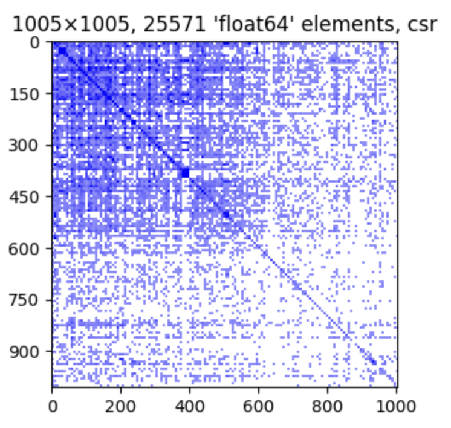
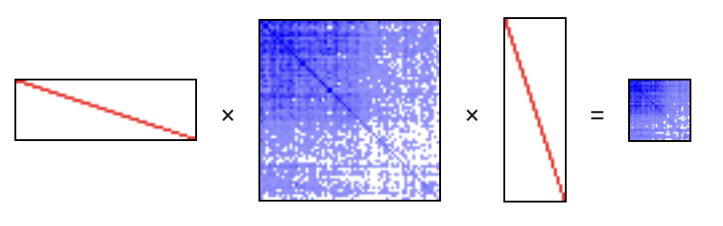
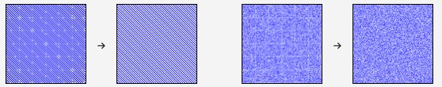

[](https://github.com/alugowski/matspy/actions/workflows/tests.yml)
[](https://codecov.io/gh/alugowski/matspy)
[](https://pypi.org/project/matspy/)

# MatSpy

Sparse matrix spy plot and sparkline renderer. Supports:
* **SciPy** - sparse matrices and arrays like `csr_matrix` and `coo_array`
* **[Python-graphblas](https://github.com/python-graphblas/python-graphblas)** - `gb.Matrix`. [See demo.](demo-python-graphblas.ipynb)

Features:
* Simple `spy()` method, similar to MatLAB's spy.
* Sparklines: `to_sparkline()` creates self-contained small spy plots for inline visuals.
* FAST.

See a [Jupyter notebook demo](demo.ipynb).

## Quick Start

```shell
pip install matspy
```

```python
from matspy import spy

spy(A)
```



## Methods
* `spy(A)`: Plot the sparsity pattern (location of nonzero values) of sparse matrix `A`.
* `to_sparkline(A)`: Return a small spy plot as a self-contained HTML string. Multiple sparklines can be automatically to-scale with each other using the `retscale` and `scale` arguments.
* `spy_to_mpl(A)`: Same as `spy()` but returns the matplotlib Figure without showing it.
* `to_spy_heatmap(A)`: Return the raw 2D array for spy plots. 

## Arguments

All methods take the same arguments. Apart from the matrix itself:

* `title`: string label. If `True`, then a matrix description is auto generated.
* `indices`: Whether to show matrix indices.
* `figsize`, `sparkline_size`: size of the plot, in inches
* `shading`: `binary`, `relative`, `absolute`.
* `buckets`: spy plot pixels (longest side).
* `dpi`: determine `buckets` relative to figure size.

### Overriding defaults
`matspy.params` contains the default values for all arguments.

For example, to default to binary shading, no title, and no indices:

```python
matspy.params.shading = 'binary'
matspy.params.title = False
matspy.params.indices = False
```

## Jupyter

`spy()` simply shows a matplotlib figure and works well within Jupyter.

`to_sparkline()` creates small spy plots that work anywhere HTML is displayed.

# Fast
All operations work with very large matrices.
A spy plot of tens of millions of elements takes less than half a second.

Large matrices are downscaled using two native matrix multiplies. The final dense 2D image is small.



Note: the spy plots in this image were created with `to_sparkline()`.

# Spy Plot Anti-Aliasing
One application of spy plots is to quickly see if a matrix has a noticeable structure.
Aliasing artifacts can give the false impression of structure where none exists,
such as moiré or even a false grid pattern.

MatSpy employs some simple methods to help eliminate these effects in most cases.



See the [Anti-Aliasing demo](demo-anti-aliasing.ipynb) for more.

# How to support more packages

Each package that MatSpy supports implements two classes:

* `Driver`: Declares what types are supported and supplies an adapter.
  * `get_supported_type_prefixes`: This declares what types are supported, as strings to avoid unnecessary imports.
  * `adapt_spy(A)`: Returns a `MatrixSpyAdapter` for a matrix that this driver supports.
* `MatrixSpyAdapter`. A common interface for extracting spy data.
  * `describe()`: Describes the adapted matrix. This description serves as the plot title.
  * `get_shape()`: Returns the adapted matrix's shape.
  * `get_spy()`: Returns spy plot data as a dense 2D numpy array.

See [matspy/adapters](matspy/adapters) for details.

You may use `matspy.register_driver` to register a Driver for your own matrix class.