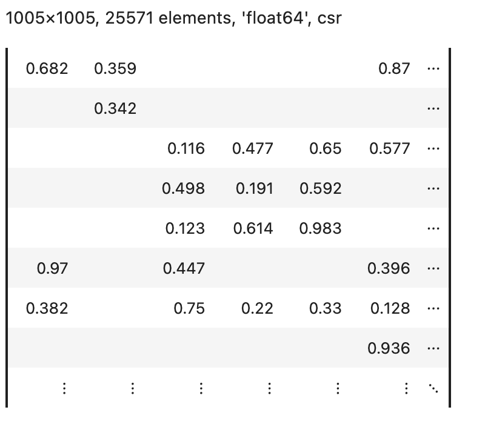
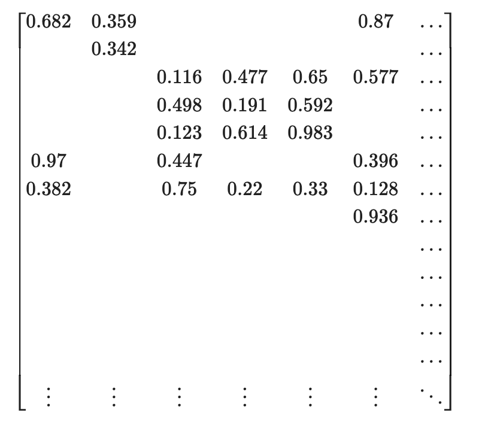
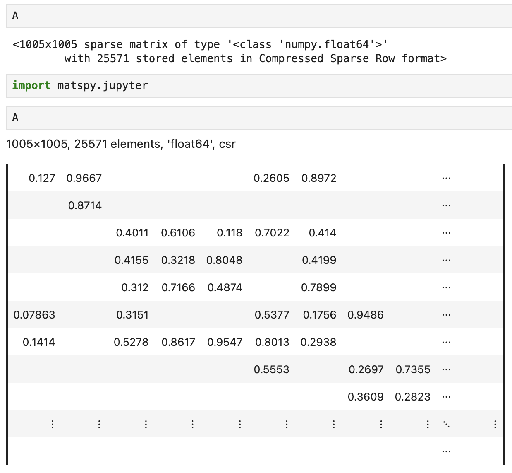

[](https://github.com/alugowski/matspy/actions/workflows/tests.yml)
[](https://codecov.io/gh/alugowski/matspy)
[](https://pypi.org/project/matspy/)

# MatSpy

Sparse matrix spy plot, HTML, and LaTeX rendering with Jupyter integration.

## Purpose

Turn this:
```
<1005x1005 sparse array of type '<class 'numpy.float64'>'
	with 25571 stored elements in Compressed Sparse Row format>
```

To one of these:

|                          Spy Plot                          |                          HTML                           |                           LaTeX                           |
|:----------------------------------------------------------:|:-------------------------------------------------------:|:---------------------------------------------------------:|
|  |  |  |
|                          `spy(A)`                          |                      `mdisplay(A)`                      |                  `mdisplay(A, 'latex')`                   |

```python
from matspy import spy, mdisplay
```

Supports:
* `scipy.sparse` sparse matrices (both `matrix` and `array` variants)
* `list`, `tuple` (HTML and LaTeX only)

## Spy plots
* `spy(A)`: Plot the sparsity pattern (location of nonzero values) of sparse matrix `A`.
* `to_sparkline(A)`: Return a small spy plot as an HTML string.
* `spy_to_mpl(A)`: Same as `spy()` but returns the matplotlib Figure without showing it.
* `to_spy_heatmap(A)`: Return the raw 2D array for spy plots. 

## Tabular
* `to_html(A)`: Format `A` as an HTML table.
* `to_latex(A)`: Format `A` as a LaTeX matrix.

These methods return a string. Use `matspy.mdisplay()` to display the HTML/LaTeX in Jupyter.

## Jupyter Integration

MatSpy can integrate with [Jupyter's formatter](https://ipython.readthedocs.io/en/stable/config/integrating.html)
to format supported sparse matrix types. Importing the `matspy.jupyter` module performs this registration:

```python
from matspy.jupyter import spy
```


If you prefer LaTeX:
```python
from matspy.jupyter_latex import spy
```

To avoid registering anything, just import `matspy`:
```python
from matspy import spy
```

### Selected arguments

#### Accepted by all methods
* `title`: string label. If `True`, then a matrix description is auto generated.
* `indices`: Whether to show matrix indices.

#### HTML/Latex
* `max_rows`, `max_rows`: size of table. Matrices larger than this are truncated with ellipses.

#### Spy plots
* `figsize`, `sparkline_size`: size of the plot, in inches
* `shading`: `binary`, `relative`, `absolute`.
* `dpi`, `buckets`: pixel count of spy plot, relative to figure size or absolute, respectively.


# Fast
All operations work with very large matrices. A spy plot of tens of millions of elements takes less than half a second.
Tabular outputs are instant.

Large matrices are downscaled using two native matrix multiplies. The final dense 2D image is small.


# Spy Plot Anti-Aliasing
One application of spy plots is to quickly see if a matrix has a noticeable structure. Aliasing artifacts can give the false impression of structure where none exists, such as moiré or even a false grid pattern.

MatSpy employs some simple methods to help eliminate these effects in most cases.


See the [Anti-Aliasing demo](demo-anti-aliasing.ipynb) for more.